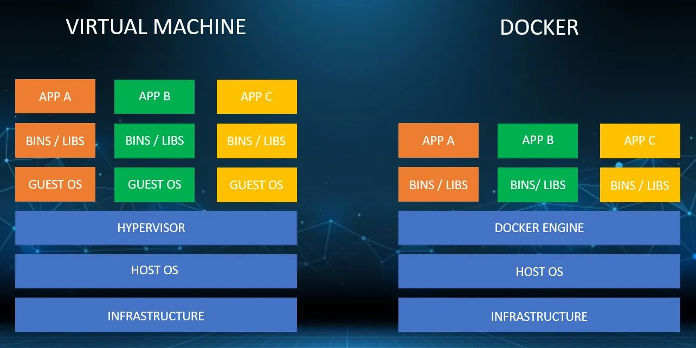

# 🐳 Docker Scout with ACR & Kubernetes

## whoami

* Threat Hunter & CTF Player
* MS Certified Security Architect
* Building Troubleshooter Club SaaS
* Former Product Mentor @SIH 2022
* Worked with Ministry of Edu & MyGov.in
* Open-Source Contributor
* Azure Developer community Leader
* Azure Blogathon Winner 2021

Linkedin :-&#x20;

<figure><figcaption></figcaption></figure>

