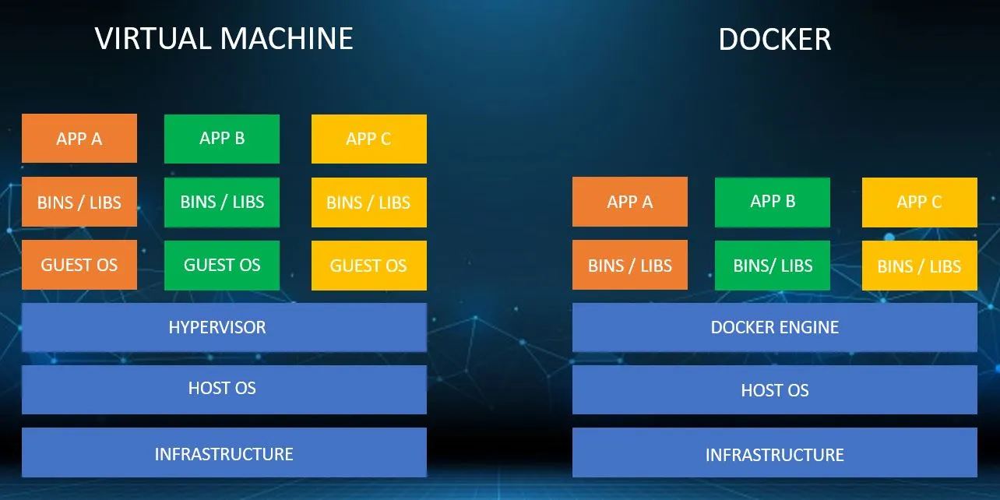

---
layout:
  title:
    visible: true
  description:
    visible: false
  tableOfContents:
    visible: true
  outline:
    visible: false
  pagination:
    visible: true
---

# 🗣 About Session

Docker 

Docker is a set of platforms as a service products that use OS-level virtualization to deliver software in packages called containers. The service has both free and premium tiers.

Docker vs VM 

[https://aws.amazon.com/compare/the-difference-between-docker-vm/](https://aws.amazon.com/compare/the-difference-between-docker-vm/)

Docker Scout

Docker Scout is a container image scanning tool built within Docker Desktop as well as CLI with mindset of Shift-Left approach.It lies on the top of the Docker ecosystem and helps developers to find container image vulnerabilities at the time of image build,thus helps organisation to ship secure entire supply chain

KillerCoda 

Killer Coda is Docker in Docker example.

It allows to create labs instances and learn .

Lab Link: -&#x20;

[https://killercoda.com/kubetools/scenario/scout](https://killercoda.com/kubetools/scenario/scout)

<a href="acr-with-docker-scout.md">ACR with Docker Scout</a>

<a href="references.md">References </a>

Session PPT


